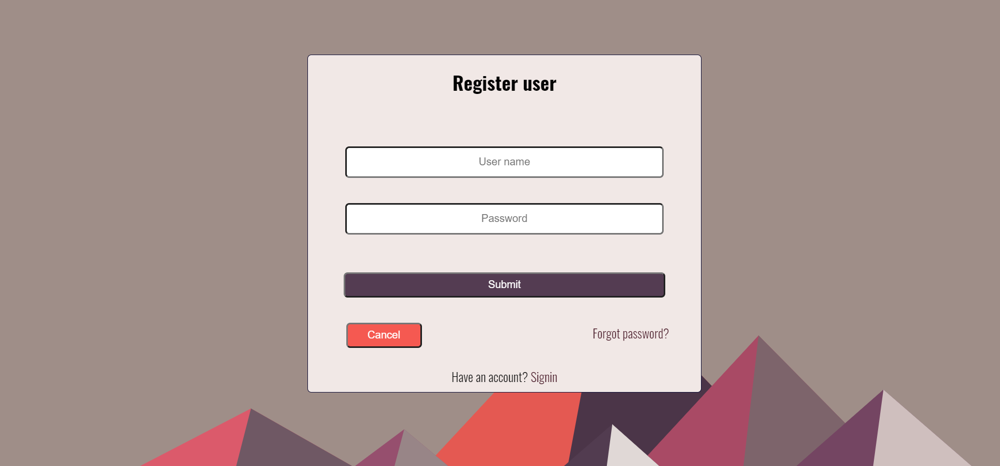

# User-authentication

## Introduction

A user authenticaiton program with a simple server build using Express and HTML ,CSS and JavaScrip for the GUI. The user data is stored is Mongo DB Atlas using Mongoose to communicate with the data base and JWT for user authentication.

#### Demo of the app is available [here](https://authentication-exercise.herokuapp.com/)

## To-do

- **form validation in the frontend**
- **rebuild the frontend using some frontend framework**
- **refactor the routes file further**
